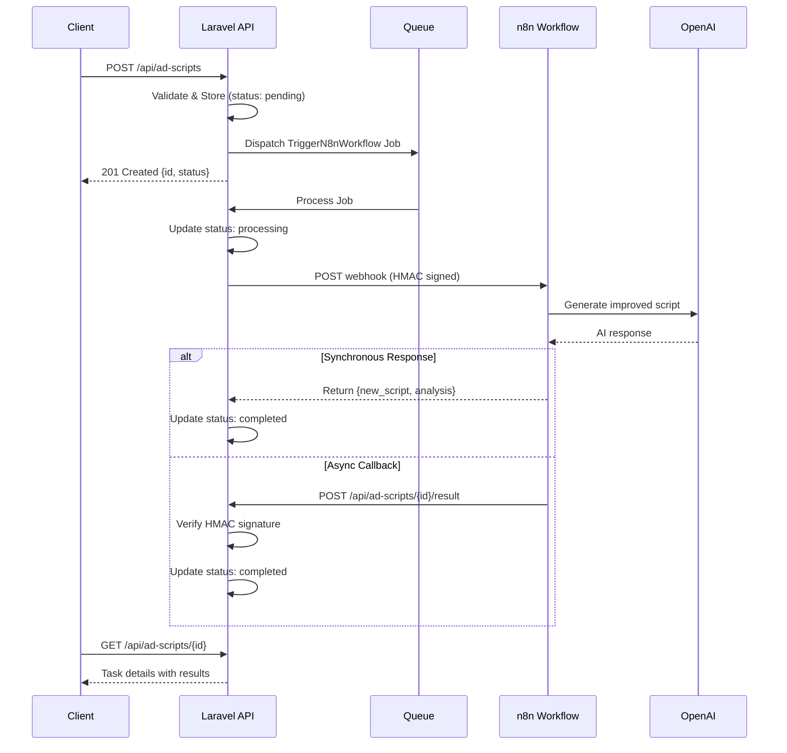

# n8n AI Agents - Laravel 10 Integration

A Laravel 10 application that integrates with n8n AI Agent workflows to automatically refactor advertising scripts using AI.

## Quick Start

```bash
# Clone and start (everything is automated)
git clone <repository-url>
cd n8nagents-v10
docker-compose up -d

# Services will be available at:
# - Laravel App:    http://localhost:8001
# - phpMyAdmin:     http://localhost:8881
# - n8n:            http://localhost:5679
```

Docker automatically handles: composer install, key generation, migrations, and queue worker.

### Database Credentials (phpMyAdmin)

| Field    | Value      |
|----------|------------|
| Server   | mysql-v10  |
| Username | laravel    |
| Password | secret     |
| Database | n8n_agents |

## Architecture



## Features

- **Async Processing**: Tasks are processed via Laravel queues for non-blocking API responses
- **HMAC Authentication**: Secure communication between Laravel and n8n using signed requests
- **Retry Logic**: Failed jobs automatically retry with exponential backoff
- **Status Tracking**: Full lifecycle tracking (pending -> processing -> completed/failed)
- **Error Handling**: Graceful error handling with detailed error messages
- **Livewire 3 Frontend**: Real-time UI with polling for status updates
- **WebSocket Support**: Pusher + Laravel Echo for instant status changes
- **PHPUnit Tests**: Comprehensive test suite (35 tests)

## Requirements

- PHP 8.2+
- Laravel 10.x
- MySQL 8.0
- Redis
- n8n instance with OpenAI credentials
- Pusher account (optional, for real-time WebSocket updates)

## n8n Workflow Setup

1. Open your n8n instance
2. Go to Workflows -> Import from File
3. Select `n8n/ad-script-workflow-sync.json`
4. Configure OpenAI credentials in the workflow
5. Set environment variable `N8N_SHARED_SECRET` to match your Laravel `N8N_SECRET`
6. Activate the workflow

## API Endpoints

### Create Task

```bash
curl -X POST http://localhost:8001/api/ad-scripts \
  -H "Content-Type: application/json" \
  -d '{
    "reference_script": "Buy our amazing product now! It is the best. Everyone loves it. Get yours today!",
    "outcome_description": "Make it more sophisticated and appeal to professional audiences"
  }'
```

Response:
```json
{
  "message": "Task created successfully.",
  "data": {
    "id": 1,
    "status": "pending"
  }
}
```

### Get Task Status

```bash
curl http://localhost:8001/api/ad-scripts/1
```

Response:
```json
{
  "data": {
    "id": 1,
    "reference_script": "Buy our amazing product...",
    "outcome_description": "Make it more sophisticated...",
    "new_script": "Elevate your professional toolkit with our premium solution...",
    "analysis": "Transformed casual language to professional tone...",
    "status": "completed",
    "error_message": null,
    "created_at": "2025-01-15T10:30:00+00:00",
    "updated_at": "2025-01-15T10:30:15+00:00"
  }
}
```

### Callback Endpoint (n8n -> Laravel)

```bash
# This is called by n8n, not manually
curl -X POST http://localhost:8001/api/ad-scripts/1/result \
  -H "Content-Type: application/json" \
  -H "X-N8N-Signature: <hmac-signature>" \
  -d '{
    "task_id": 1,
    "new_script": "Improved script content",
    "analysis": "Analysis of changes"
  }'
```

## Running Tests

```bash
# Run all tests
php artisan test

# Run with coverage
php artisan test --coverage

# Run specific test file
php artisan test tests/Feature/AdScriptApiTest.php
```

## Project Structure

```
app/
├── Enums/
│   └── TaskStatus.php          # Task status enum
├── Events/
│   └── TaskStatusUpdated.php   # Broadcasting event
├── Http/
│   ├── Controllers/
│   │   └── AdScriptController.php
│   ├── Middleware/
│   │   └── VerifyN8nSignature.php
│   └── Requests/
│       ├── AdScriptResultRequest.php
│       └── StoreAdScriptRequest.php
├── Jobs/
│   └── TriggerN8nWorkflow.php  # Async job for n8n calls
├── Livewire/
│   ├── TaskCreate.php
│   ├── TaskList.php
│   └── TaskShow.php
├── Models/
│   └── AdScriptTask.php
└── Services/
    └── N8nService.php          # n8n HTTP client with HMAC

database/
├── factories/
│   └── AdScriptTaskFactory.php
└── migrations/
    └── *_create_ad_script_tasks_table.php

n8n/
└── ad-script-workflow-sync.json # Synchronous response workflow

tests/
├── Feature/
│   ├── AdScriptApiTest.php
│   ├── N8nServiceTest.php
│   └── TriggerN8nWorkflowJobTest.php
└── Unit/
    └── AdScriptTaskTest.php
```

## Database Schema

```sql
CREATE TABLE ad_script_tasks (
    id INTEGER PRIMARY KEY,
    reference_script TEXT NOT NULL,
    outcome_description TEXT NOT NULL,
    new_script TEXT,
    analysis TEXT,
    status VARCHAR(20) DEFAULT 'pending',
    error_message TEXT,
    created_at TIMESTAMP,
    updated_at TIMESTAMP
);
```

## Security

- **HMAC Signatures**: All requests between Laravel and n8n are signed using HMAC-SHA256
- **Input Validation**: Strict validation on all API inputs
- **Environment Secrets**: All sensitive values stored in `.env` (not committed)
- **Timing-Safe Comparison**: Signature verification uses `hash_equals()` to prevent timing attacks

## Configuration

| Variable | Description | Default |
|----------|-------------|---------|
| `N8N_WEBHOOK_URL` | n8n webhook endpoint | `http://localhost:5678/webhook/ad-script` |
| `N8N_SECRET` | Shared secret for HMAC | `change-me-in-production` |
| `N8N_TIMEOUT` | HTTP timeout in seconds | `60` |

## Assumptions & Shortcuts

1. **Authentication**: No user authentication implemented - in production, add Laravel Sanctum or Passport
2. **Rate Limiting**: No rate limiting - add in production via Laravel's throttle middleware
3. **Database**: Uses MySQL via Docker - configure as needed for production
4. **Logging**: Basic logging - enhance with structured logging for production
5. **Monitoring**: No APM integration - add in production

## n8n Workflow Details

The workflow (`ad-script-workflow-sync.json`):
- Accepts POST requests at `/webhook/ad-script`
- Uses GPT-4o for script analysis and generation
- Returns JSON with `task_id`, `new_script`, `analysis`
- Responds synchronously to the webhook call

## Troubleshooting

### Queue not processing jobs
```bash
# Ensure queue worker is running
php artisan queue:work

# Check failed jobs
php artisan queue:failed
```

### n8n webhook not receiving requests
1. Verify `N8N_WEBHOOK_URL` matches your n8n webhook path
2. Check n8n workflow is active
3. Verify network connectivity between services

### Signature verification failing
1. Ensure `N8N_SECRET` matches `N8N_SHARED_SECRET` in n8n
2. Check request body is valid JSON
3. Verify no middleware is modifying the request body

## License

MIT
